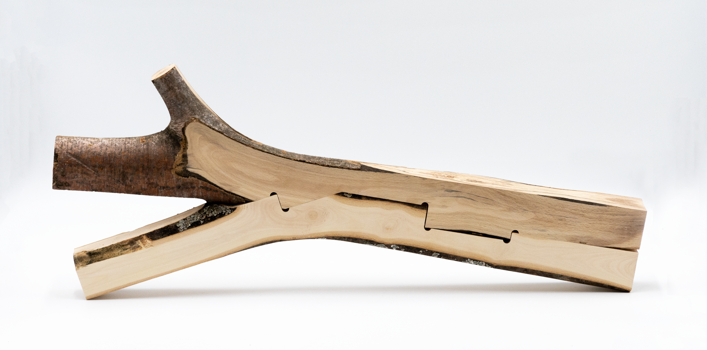
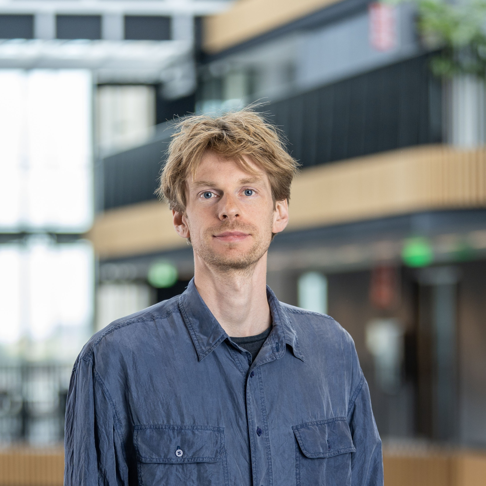
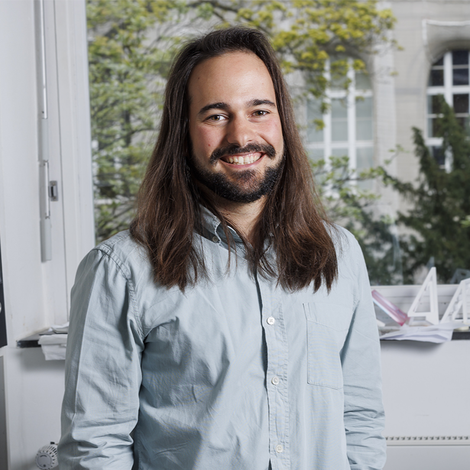

# Under the Canopy: From Forest Geometry to Structural Form

> **Future of Construction 2026 Workshop**

* **Date:** May 20, 2026
* **Instructors:** Simon Griffioen, Kevin Moreno Gata, Tatsuki Fujiu

## Overview

This hands-on and discussion-based workshop challenges participants to explore how raw, irregular timber, often treated as leftover material, can be integrated into future construction. The use of irregular natural materials in architecture has the potential to expand design expression while reducing environmental impact. Through alternating expert inputs and hands-on activities, including 3D reconstruction and a design exercise, the workshop introduces key challenges and opportunities from a structural perspective. Inputs on geometry, structural practice and robotics establish a shared understanding, which is then used to collectively discuss how emerging technologies can support the adoption of raw timber in industry.

## Workshop Structure & Activities

The workshop combines expert inputs, hands-on material exploration, collaborative design work, and group discussion to guide participants from understanding raw timber geometry to reflecting its potential in construction. Participants actively prototype ideas through physical testing and digital modeling before critically discussing adoption challenges, producing both spatial configurations and shared insights. 

1. **Material & Geometry Analysis (Hands-On)**: Participants work directly with raw tree forks through physical inspection, 3D scanning, 3D reconstruction, and parametric analysis to understand irregular geometry as design input. 
2. **Structural Practice Context (Expert Input)**: Summum Engineering introduces current professional practice, highlighting possibilities, limitations, and regulatory constraints for using irregular timber in industry, as well as realistic pathways for integrating irregular timber into industry workflows.
3. **Topology & Configuration Study (Hands-On)**: Teams physically and digitally configure structural systems using branch sets and a 3D-printed library, selecting or developing topologies and defining repeatable rules.
4. **Fabrication & Robotics Context (Expert Input)**: Reference projects and workflows are presented to explain robotic fabrication, connection strategies, and production constraints.

**Team-Based Synthesis & Discussion**
Teams select two themes (robotics, AI, extended reality), prepare short presentations, and engage in a moderated final discussion on adoption challenges in AEC.

## Agenda

| Time | Topic/Task | Notes |
| :---- | :---- | :---- |
| 09:00-09:15 | Intro | |
| 09:15-09:45 | Why This Matters: Relevance & Framing | |
| 09:45-11:00 | Material & Geometry Analysis | hands-on |
| 11:00-11:30 | Structural Practice Contex | |
| 11:30-12:30 | Topology & Configuration Study | hands-on, part 1 |
| 12:30-13:30 | Lunch | |
| 13:30-14:30 | Topology & Configuration Study | hands-on, part 2 |
| 14:30-15:00 | Fabrication & Robotics Context | |
| 15:00-16:00 | Team-Based Synthesis | |
| 16:00-17:00 | Group Presentations & Final Discussion | |

## Team

### Simon Griffioen

Simon is a researcher, teacher, and architect specializing in digital fabrication. At the Robot Lab of the Amsterdam University of Applied Sciences, his current research explores how leftover branches and forks can be used in construction with the help of digital (production) tools.

* **LinkedIn**: [Profile](https://www.linkedin.com/in/simongriffioen/)

### Kevin Moreno Gata

Kevin is an architect and researcher at RWTH Aachen University (Chair of Structures and Structural Design) and holds a doctoral degree in timber design. His work lies at the intersection of computational modelling, structural design, and digital fabrication, investigating how naturally grown timber can serve as a basis for load-bearing structures.

* **LinkedIn**: [Profile](https://www.linkedin.com/in/kevinmoga/)

### Tatsuki Fujiu

Tatsuki is a structural engineer at Summum Engineering, bridging sustainable timber and earth design with advanced digitalization. He pushes the boundaries of computational design by developing custom tools and integrating AI-driven workflows to automate and optimize complex structural systems.

* **LinkedIn**: [Profile](https://www.linkedin.com/in/tatsuki-fujiu/)

